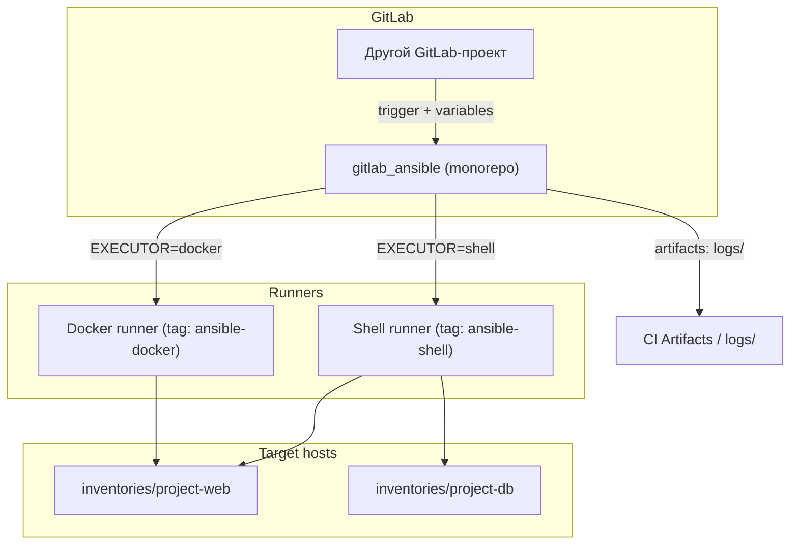

# Единый GitLab CI для Ansible (IaC)

## Архитектурное решение

Рекомендуемая модель: **monorepo + child pipelines** — один GitLab-репозиторий для всего Ansible-кода, где каждый playbook/role = отдельный CI job/child pipeline. Это закрывает требования 1 и 2 без дублирования шаблонов.



**Executor по умолчанию:** shell (по вашему ответу). Docker — через переменную `EXECUTOR=docker`.

---

## Структура репозитория

Создать в [`/home/user/project/gitlab_ansible`](/home/user/project/gitlab_ansible):

```
gitlab_ansible/
├── .gitlab-ci.yml                 # Корневой pipeline (validate + trigger child)
├── ansible.cfg
├── requirements.yml
├── .ansible-lint
├── .yamllint
├── .gitignore
├── ci/
│   ├── templates/
│   │   ├── ansible-run.yml        # Общий шаблон запуска (shell + docker)
│   │   ├── validate.yml           # lint, syntax-check
│   │   └── trigger-external.yml   # Шаблон для внешних проектов
│   ├── scripts/
│   │   └── run-ansible.sh         # Единый скрипт запуска + логирование
│   └── docker/
│       └── Dockerfile             # Кастомный образ (опционально)
├── inventories/                   # Hosts разделены по «проектам»
│   ├── project-web/
│   │   ├── hosts.yml
│   │   ├── group_vars/
│   │   └── host_vars/
│   ├── project-db/
│   └── project-monitoring/
├── playbooks/
│   ├── deploy-web/
│   │   ├── playbook.yml
│   │   └── ci.yml                 # Метаданные: inventory, tags, executor
│   └── deploy-db/
├── roles/
│   ├── nginx/
│   └── postgresql/
├── logs/                          # .gitkeep — артефакты CI
└── docs/
    ├── runner-shell-setup.md      # Настройка shell runner
    └── external-trigger.md        # Запуск из других проектов
```

Каждый playbook/role содержит файл `ci.yml` с привязкой к inventory:

```yaml
# playbooks/deploy-web/ci.yml
name: deploy-web
type: playbook
inventory: project-web
default_executor: shell
allowed_executors: [shell, docker]
tags: [web, deploy]
```

---

## 1. Единый CI-шаблон ([`ci/templates/ansible-run.yml`](/home/spiritd/Документы/gitlab_ansible/ci/templates/ansible-run.yml))

Один переиспользуемый hidden job `.ansible_run`:

| Переменная | Назначение | Пример |
|---|---|---|
| `PLAYBOOK` | Путь к playbook | `playbooks/deploy-web/playbook.yml` |
| `ROLE` | Имя role (генерирует temp playbook) | `nginx` |
| `INVENTORY` | Каталог inventory | `project-web` |
| `EXECUTOR` | `shell` или `docker` | `shell` |
| `TAGS`, `SKIP_TAGS`, `LIMIT` | Параметры Ansible | `install,config` |
| `EXTRA_VARS` | JSON или key=value | `version=2.0` |
| `CHECK_MODE` | dry-run | `true` |
| `ANSIBLE_VAULT_PASSWORD` | CI/CD Variable (masked) | — |

**Shell executor** — job без `image`, tag `ansible-shell`:

```yaml
.run_ansible_shell:
  tags: [ansible-shell]
  before_script:
    - ansible --version
    - bash ci/scripts/run-ansible.sh --prepare
  script:
    - bash ci/scripts/run-ansible.sh --run
  artifacts:
    paths:
      - logs/
    expire_in: 30 days
    when: always
```

**Docker executor** — tag `ansible-docker`, image `willhallonline/ansible:2.16-alpine`:

```yaml
.run_ansible_docker:
  image:
    name: willhallonline/ansible:2.16-alpine
    entrypoint: [""]
  tags: [ansible-docker]
  # тот же script через run-ansible.sh
```

Выбор executor через `rules` + переменную `EXECUTOR`.

---

## 2. Один CI job = один playbook/role

Корневой [`.gitlab-ci.yml`](/home/spiritd/Документы/gitlab_ansible/.gitlab-ci.yml):

```yaml
stages: [validate, deploy]

include:
  - local: ci/templates/validate.yml
  - local: ci/templates/ansible-run.yml

# Автогенерация jobs из playbooks/*/ci.yml
deploy:deploy-web:
  extends: .ansible_run
  variables:
    PLAYBOOK: playbooks/deploy-web/playbook.yml
    INVENTORY: project-web
  rules:
    - if: $TARGET == "deploy-web"
    - if: $CI_PIPELINE_SOURCE == "trigger"
      when: manual
    - when: manual
```

Для roles — аналогично с `ROLE: nginx`.

**Ручной запуск через GitLab UI:** CI/CD → Run pipeline → указать `TARGET=deploy-web`, `EXECUTOR=shell`, `TAGS=install`.

---

## 3. Разделение hosts по проектам

Каждый playbook привязан к своему inventory через `ci.yml`:

```
inventories/project-web/hosts.yml   → playbooks/deploy-web/
inventories/project-db/hosts.yml    → playbooks/deploy-db/
```

Inventory в формате YAML (по [reglament_ansible.md](/home/spiritd/Документы/myrepo/mydocs/reglament_ansible.md)):

```yaml
# inventories/project-web/hosts.yml
all:
  children:
    webservers:
      hosts:
        web01:
          ansible_host: 192.168.1.10
```

Секреты — через Ansible Vault + CI Variable `ANSIBLE_VAULT_PASSWORD`. Файлы `group_vars/all/vault.yml` зашифрованы.

`ansible.cfg` указывает базовый путь:

```ini
[defaults]
roles_path = roles
host_key_checking = True
stdout_callback = yaml
forks = 20
pipelining = True
```

Inventory передаётся явно: `-i inventories/${INVENTORY}/hosts.yml`.

---

## 4–5. Настройка GitLab Runner (shell)

Документ [`docs/runner-shell-setup.md`](/home/spiritd/Документы/gitlab_ansible/docs/runner-shell-setup.md) на основе существующего шаблона [`ans_gitlab_git-runner_install.md`](/home/spiritd/Документы/myrepo/ansdoc/ans_gitlab_git-runner_install.md).

### Установка на сервере-раннере

```bash
# Регистрация shell runner
gitlab-runner register \
  --non-interactive \
  --url "https://gitlab.company.local" \
  --token "<RUNNER_AUTH_TOKEN>" \
  --executor "shell" \
  --description "ansible-shell-runner" \
  --tag-list "ansible-shell" \
  --run-untagged="false"
```

### `/etc/gitlab-runner/config.toml`

```toml
concurrent = 4

[[runners]]
  name = "ansible-shell-runner"
  url = "https://gitlab.company.local"
  token = "..."
  executor = "shell"
  shell = "bash"
  [runners.custom_build_dir]
  [runners.cache]
    MaxUploadedArchiveSize = 0
  tag_list = ["ansible-shell"]
  run_untagged = false
  environment = ["ANSIBLE_FORCE_COLOR=1", "ANSIBLE_HOST_KEY_CHECKING=True"]
```

### Подготовка сервера-раннера

- Пользователь `gitlab-runner` (или `git-runner` по [`ans_git-runner_add_user.md`](/home/spiritd/Документы/myrepo/ansdoc/ans_git-runner_add_user.md))
- Установить Ansible: `pip install ansible ansible-lint` или пакет из репозитория
- SSH-ключ `gitlab-runner` → authorized_keys на target hosts
- Права sudo (NOPASSWD) — только если playbook требует `become: yes`
- Рабочая директория: `/home/gitlab-runner/builds/` (по умолчанию)

### Docker runner (опционально)

Отдельный runner с tag `ansible-docker`, executor `docker`. Используется когда shell runner недоступен или нужна изоляция.

---

## 6. Централизованное логирование

Скрипт [`ci/scripts/run-ansible.sh`](/home/spiritd/Документы/gitlab_ansible/ci/scripts/run-ansible.sh):

```bash
LOG_DIR="${CI_PROJECT_DIR}/logs"
LOG_FILE="${LOG_DIR}/${CI_PIPELINE_ID}_${CI_JOB_NAME}_$(date +%Y%m%d_%H%M%S).log"
mkdir -p "$LOG_DIR"

ansible-playbook ... 2>&1 | tee "$LOG_FILE"
EXIT_CODE=${PIPESTATUS[0]}

# Метаданные в начало лога
echo "Pipeline: $CI_PIPELINE_ID | Job: $CI_JOB_NAME | Playbook: $PLAYBOOK" >> "$LOG_FILE"

exit $EXIT_CODE
```

- **CI Artifacts:** `logs/` сохраняются 30 дней (`when: always`)
- **JUnit report** (опционально): callback plugin `ansible.posix.profile_tasks` или `community.general.junit`
- Логи доступны в GitLab: Job → Browse artifacts → `logs/`

---

## 7. Запуск из других GitLab-проектов

Два механизма (документ [`docs/external-trigger.md`](/home/spiritd/Документы/gitlab_ansible/docs/external-trigger.md)):

### A. Pipeline trigger (рекомендуется)

В `gitlab_ansible/.gitlab-ci.yml`:

```yaml
workflow:
  rules:
    - if: $CI_PIPELINE_SOURCE == "trigger"
    - if: $CI_PIPELINE_SOURCE == "web"
    - if: $CI_COMMIT_BRANCH == "main"
```

В другом проекте `.gitlab-ci.yml`:

```yaml
trigger_ansible_deploy:
  stage: deploy
  trigger:
    project: infrastructure/gitlab_ansible
    branch: main
    strategy: depend
  variables:
    TARGET: "deploy-web"
    EXECUTOR: "shell"
    TAGS: "deploy"
    EXTRA_VARS: "version=${CI_COMMIT_TAG}"
  when: manual
```

### B. Trigger token (API / webhook)

1. Settings → CI/CD → Pipeline triggers → Add trigger
2. Вызов: `curl -X POST -F token=TOKEN -F ref=main -F "variables[TARGET]=deploy-web" https://gitlab.../trigger/pipeline`

### C. Шаблон для include

Файл [`ci/templates/trigger-external.yml`](/home/spiritd/Документы/gitlab_ansible/ci/templates/trigger-external.yml) — готовый job, который другие проекты подключают через:

```yaml
include:
  - project: infrastructure/gitlab_ansible
    ref: main
    file: ci/templates/trigger-external.yml
```

---

## Этапы реализации

### Фаза 1 — Bootstrap репозитория
- Инициализировать git, создать структуру каталогов
- `ansible.cfg`, `.gitignore`, `requirements.yml`, lint-конфиги
- Пример playbook `deploy-web` + role `nginx`
- Пример inventory `project-web`

### Фаза 2 — CI/CD core
- `ci/scripts/run-ansible.sh` с логированием
- `ci/templates/ansible-run.yml` (shell + docker)
- `ci/templates/validate.yml` (lint, syntax-check)
- Корневой `.gitlab-ci.yml`

### Фаза 3 — Runner и документация
- `docs/runner-shell-setup.md` — полная инструкция
- `docs/external-trigger.md` — примеры trigger
- README с quick start

### Фаза 4 — GitLab настройка (ручные шаги)
- Создать проект `gitlab_ansible` в GitLab
- Зарегистрировать shell runner с tag `ansible-shell`
- Добавить CI/CD Variables: `ANSIBLE_VAULT_PASSWORD`, SSH keys
- Создать pipeline trigger token
- Push репозитория, проверить pipeline

---

## Проверка (test plan)

1. **Validate stage:** push в main → lint + syntax-check проходят
2. **Shell run:** Run pipeline → `TARGET=deploy-web`, `EXECUTOR=shell`, `CHECK_MODE=true` → job завершается, log в artifacts
3. **Inventory isolation:** `deploy-web` использует только `project-web` hosts
4. **External trigger:** из тестового проекта trigger → pipeline в `gitlab_ansible` запускается с переданными variables
5. **Role run:** `ROLE=nginx`, `INVENTORY=project-web` → role выполняется через temp playbook
6. **Логи:** после job → Browse artifacts → файл `logs/<pipeline_id>_*.log` существует
