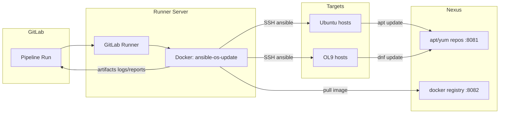

Режим **Ask** — я не могу создать репозиторий и файлы за вас, но ниже готовая архитектура проекта, которую можно сразу реализовать. Она опирается на ваши шаблоны из `gitlab_ansible_role_playbook_docker.md` и `gitlab_ansible_playbooks.md`.

---

## Цель проекта

GitLab CI/CD + Ansible для безопасного обновления **Ubuntu** и **Oracle Linux 9** с:
- предварительными проверками,
- поэтапным логированием,
- отчётом после обновления,
- настройкой параметров через **Run pipeline** в GitLab.

---

## Структура репозитория

```
linux-os-update/
├── .gitlab-ci.yml
├── ansible.cfg
├── requirements.yml
├── site.yml                          # главный плейбук (все этапы)
├── inventory/
│   ├── production/
│   │   ├── hosts.yml
│   │   └── group_vars/
│   │       ├── all.yml
│   │       ├── ubuntu.yml
│   │       └── ol9.yml
│   └── staging/
│       └── ...
├── playbooks/
│   ├── pre_check.yml
│   ├── update.yml
│   └── report.yml
├── roles/
│   ├── common_logging/               # единый логгер этапов
│   ├── pre_check_repos/              # проверка репозиториев
│   ├── pre_check_connectivity/       # доступность mirror/repo
│   ├── pre_check_locks/              # apt/dnf/yum locks
│   ├── os_update_ubuntu/
│   ├── os_update_ol9/
│   └── post_update_report/
├── templates/
│   └── report.html.j2
├── logs/                             # артефакты CI (создаётся в runtime)
└── reports/
```

---

## Этапы выполнения (Ansible tags)

| Этап | Tag | Что делает |
|------|-----|------------|
| 1. Pre-check repos | `precheck_repos` | Проверка `/etc/apt/sources.list*`, `/etc/yum.repos.d/`, `dnf repolist`, `apt-cache policy` |
| 2. Pre-check connectivity | `precheck_connectivity` | `uri`/`get_url`/`ping` к URL репозиториев, DNS, proxy |
| 3. Pre-check locks | `precheck_locks` | `/var/lib/dpkg/lock*`, `/var/run/yum.pid`, `dnf history`, `needs-restarting` |
| 4. Update | `update` | `apt upgrade` / `dnf update --security` |
| 5. Report | `report` | Сбор фактов, diff версий, reboot required, HTML/JSON отчёт |

Главный плейбук `site.yml`:

```yaml
---
- name: Linux OS Update Pipeline
  hosts: all
  gather_facts: true
  serial: "{{ update_serial | default(1) }}"
  vars:
    log_dir: "/var/log/ansible-os-update/{{ ansible_date_time.date }}"
    report_dir: "{{ playbook_dir }}/reports"

  pre_tasks:
    - name: Init stage logging
      ansible.builtin.include_role:
        name: common_logging
        tasks_from: init.yml

  roles:
    - role: pre_check_repos
      tags: [precheck, precheck_repos]
      when: run_precheck | default(true) | bool

    - role: pre_check_connectivity
      tags: [precheck, precheck_connectivity]
      when: run_precheck | default(true) | bool

    - role: pre_check_locks
      tags: [precheck, precheck_locks]
      when: run_precheck | default(true) | bool

    - role: os_update_ubuntu
      tags: [update]
      when:
        - run_update | default(true) | bool
        - ansible_os_family == "Debian"

    - role: os_update_ol9
      tags: [update]
      when:
        - run_update | default(true) | bool
        - ansible_distribution == "OracleLinux"
        - ansible_distribution_major_version == "9"

    - role: post_update_report
      tags: [report]
      when: run_report | default(true) | bool

  post_tasks:
    - name: Finalize logging
      ansible.builtin.include_role:
        name: common_logging
        tasks_from: finalize.yml
```

---

## Предварительные проверки (детали)

### 1. Настройки репозиториев

**Ubuntu:**
- наличие `sources.list` и `sources.list.d/*.list`
- отсутствие `deb cdrom:` в prod
- `apt-cache policy` — есть ли release/candidate
- при `use_internal_mirror=true` — только разрешённые mirror URL

**Oracle Linux 9:**
- файлы в `/etc/yum.repos.d/`
- `dnf repolist enabled`
- включён ли `ol9_*` / `UEKR` / ваш internal mirror
- `subscription-manager status` (если используется)

### 2. Доступность серверов репозиториев

```yaml
# Пример задачи в pre_check_connectivity
- name: Check repo URL availability
  ansible.builtin.uri:
    url: "{{ item }}"
    method: GET
    status_code: [200, 301, 302, 404]
    timeout: 10
  loop: "{{ repo_urls }}"
  register: repo_check
  failed_when: repo_check.status is not defined or repo_check.status >= 500
```

Дополнительно: `wait_for` на 443/80, проверка DNS (`dig`), proxy (`http_proxy`).

### 3. Блокировки (locks)

**Ubuntu:**
```bash
fuser /var/lib/dpkg/lock-frontend
fuser /var/lib/apt/lists/lock
pgrep -a apt | pgrep -a dpkg
```

**OL9:**
```bash
test -f /var/run/yum.pid && cat /var/run/yum.pid
test -f /var/run/dnf.pid
dnf history list last
```

При обнаружении lock — **fail** с понятным сообщением в лог (не продолжать update).

---

## Логирование каждого этапа

Роль `common_logging`:

```yaml
# roles/common_logging/tasks/log_stage.yml
- name: "LOG | {{ stage_name }} | START"
  ansible.builtin.lineinfile:
    path: "{{ log_dir }}/pipeline.log"
    line: "[{{ ansible_date_time.iso8601 }}] [{{ inventory_hostname }}] [{{ stage_name }}] START"
    create: true
  delegate_to: localhost
  run_once: false

- name: "LOG | {{ stage_name }} | END"
  ansible.builtin.lineinfile:
    path: "{{ log_dir }}/pipeline.log"
    line: "[{{ ansible_date_time.iso8601 }}] [{{ inventory_hostname }}] [{{ stage_name }}] END status={{ stage_status }}"
    create: true
  delegate_to: localhost
```

В `ansible.cfg`:

```ini
[defaults]
log_path = ./logs/ansible.log
callback_whitelist = profile_tasks, timer, json
stdout_callback = yaml

[callback_json]
log_file = ./logs/ansible-json.log
```

В GitLab CI — сохранять `logs/` и `reports/` как artifacts.

---

## Отчёт после обновления

Роль `post_update_report` собирает:

- hostname, OS, kernel до/после
- список обновлённых пакетов (`apt list --upgradable` / `dnf history info`)
- требуется ли reboot (`/var/run/reboot-required`, `needs-restarting -r`)
- результат pre-check
- ошибки/предупреждения

**Форматы:**
- `reports/update-report-{{ inventory_hostname }}.json`
- `reports/update-report-{{ inventory_hostname }}.html` (шаблон Jinja2)
- сводный `reports/summary.json` (через `run_once` + `set_fact`)

Пример JSON:

```json
{
  "hostname": "web-01",
  "os": "Ubuntu 22.04",
  "started_at": "2026-07-02T10:00:00",
  "finished_at": "2026-07-02T10:25:00",
  "precheck": {"repos": "ok", "connectivity": "ok", "locks": "ok"},
  "packages_updated": 42,
  "reboot_required": true,
  "status": "success"
}
```

---

## GitLab CI — параметры перед запуском

Рекомендуется **GitLab 15.7+** с `spec.inputs` (удобнее, чем только CI Variables):

```yaml
spec:
  inputs:
    inventory:
      description: "Inventory (production/staging)"
      default: production
      options: [production, staging]
    target_hosts:
      description: "Ansible --limit (например web:&ubuntu)"
      default: "all"
    os_family:
      description: "Фильтр ОС"
      default: "all"
      options: [all, ubuntu, ol9]
    run_precheck:
      type: boolean
      default: true
    run_update:
      type: boolean
      default: true
    run_report:
      type: boolean
      default: true
    update_type:
      description: "Тип обновления"
      default: security
      options: [security, all]
    reboot_if_required:
      type: boolean
      default: false
    check_mode:
      type: boolean
      default: false
    update_serial:
      description: "Кол-во хостов одновременно"
      default: "1"

---

stages:
  - validate
  - precheck
  - update
  - report

variables:
  ANSIBLE_FORCE_COLOR: "1"
  ANSIBLE_ROLES_PATH: "${CI_PROJECT_DIR}/roles"
  DOCKER_IMAGE: "quay.io/ansible/ansible-runner:latest"

.ansible_base:
  image: $DOCKER_IMAGE
  tags: [ansible]
  before_script:
    - mkdir -p logs reports
    - ansible-galaxy install -r requirements.yml -p roles || true
    - echo "$SSH_PRIVATE_KEY" | tr -d '\r' > id_rsa && chmod 600 id_rsa
    - export ANSIBLE_PRIVATE_KEY_FILE=$CI_PROJECT_DIR/id_rsa

validate:
  stage: validate
  extends: .ansible_base
  script:
    - ansible-playbook site.yml --syntax-check
    - ansible-lint site.yml || true
  rules:
    - when: always

precheck:
  stage: precheck
  extends: .ansible_base
  script:
    - |
      ansible-playbook site.yml \
        -i inventory/$[[ inputs.inventory ]]/hosts.yml \
        --limit "$[[ inputs.target_hosts ]]" \
        --tags precheck \
        --extra-vars '{
          "run_precheck": $[[ inputs.run_precheck ]],
          "run_update": false,
          "run_report": false,
          "update_type": "$[[ inputs.update_type ]]"
        }' \
        ${CHECK_MODE:+--check}
  artifacts:
    paths: [logs/, reports/]
    expire_in: 30 days
  rules:
    - when: manual

update:
  stage: update
  extends: .ansible_base
  needs: [precheck]
  script:
    - |
      EXTRA="run_update=$[[ inputs.run_update ]] reboot_if_required=$[[ inputs.reboot_if_required ]]"
      ansible-playbook site.yml \
        -i inventory/$[[ inputs.inventory ]]/hosts.yml \
        --limit "$[[ inputs.target_hosts ]]" \
        --tags update \
        --extra-vars "$EXTRA update_type=$[[ inputs.update_type ]] update_serial=$[[ inputs.update_serial ]]" \
        $([[ "$[[ inputs.check_mode ]]" == "true" ]] && echo "--check")
  artifacts:
    paths: [logs/, reports/]
  rules:
    - when: manual

report:
  stage: report
  extends: .ansible_base
  needs: [update]
  script:
    - |
      ansible-playbook site.yml \
        -i inventory/$[[ inputs.inventory ]]/hosts.yml \
        --limit "$[[ inputs.target_hosts ]]" \
        --tags report \
        --extra-vars "run_report=$[[ inputs.run_report ]]"
  artifacts:
    name: "os-update-report-$CI_PIPELINE_ID"
    paths: [reports/, logs/]
    expire_in: 90 days
  rules:
    - when: on_success
```

**Запуск:** CI/CD → Pipelines → **Run pipeline** → выбрать branch → задать параметры (inventory, limit, тип обновления и т.д.).

---

## Переменные плейбука (group_vars)

`inventory/production/group_vars/all.yml`:

```yaml
repo_urls:
  - "https://archive.ubuntu.com/ubuntu/"
  - "https://yum.oracle.com/"

allowed_ubuntu_mirrors:
  - "https://mirror.internal.corp/ubuntu/"

update_serial: 1
update_type: security          # security | all
reboot_if_required: false
fail_on_lock: true
log_to_gitlab_artifact: true
```

`inventory/production/group_vars/ubuntu.yml`:

```yaml
apt_update_options:
  - "-y"
  - "--no-install-recommends"
```

`inventory/production/group_vars/ol9.yml`:

```yaml
dnf_update_options:
  - "--security"   # при update_type=security
  - "-y"
```

---

## Inventory (пример)

```yaml
# inventory/production/hosts.yml
all:
  children:
    ubuntu:
      hosts:
        web-01.example.com:
        db-01.example.com:
    ol9:
      hosts:
        app-01.example.com:
        app-02.example.com:
```

---

## Роли обновления (кратко)

**Ubuntu (`os_update_ubuntu`):**
1. `apt-get update`
2. snapshot пакетов до обновления
3. `apt upgrade` или `unattended-upgrade` (по `update_type`)
4. проверка `/var/run/reboot-required`
5. опционально reboot

**Oracle Linux 9 (`os_update_ol9`):**
1. `dnf clean all && dnf makecache`
2. `dnf update --security` или `dnf update`
3. `needs-restarting -r`
4. опционально reboot

---

## Безопасность (по вашему регламенту)

- SSH-ключ в GitLab CI Variable `SSH_PRIVATE_KEY` (masked, protected)
- Vault для паролей: `ansible-vault` + `ANSIBLE_VAULT_PASSWORD`
- Production — только **manual** jobs
- `serial: 1` по умолчанию для rolling update
- `--check` через параметр `check_mode` перед боевым запуском

---

## Рекомендуемый workflow оператора

1. **Run pipeline** с `check_mode=true`, `run_update=false` — dry-run precheck  
2. **Run pipeline** precheck → update (security) → report  
3. Скачать artifact `reports/` из GitLab  
4. При `reboot_required=true` — отдельный pipeline с `reboot_if_required=true`

---

## Что можно добавить позже

- Molecule-тесты для ролей (Ubuntu + OL9 контейнеры)
- интеграция с AWX/Tower
- отправка отчёта в email/Slack/Telegram
- compliance-check (CIS, OpenSCAP)

---

Если нужно, чтобы я **создал репозиторий с этими файлами**, переключитесь в **Agent mode** — тогда смогу сгенерировать полный проект (roles, playbooks, `.gitlab-ci.yml`, README) в `~/Projects/linux-os-update` или в указанную вами директорию.

Уточните также:
- используете **GitLab Runner** с тегом `ansible` или Docker executor?

------------------------------

Режим **Ask** — файлы в репозиторий не добавляю; ниже обновлённая архитектура проекта с учётом Nexus, GitLab Runner на отдельном сервере и собственного Docker-образа Ansible.

---

## Обновлённая структура проекта

```
linux-os-update/
├── .gitlab-ci.yml
├── ansible.cfg
├── requirements.yml
├── site.yml
├── Dockerfile                          # NEW: кастомный образ Ansible
├── docker/
│   ├── entrypoint.sh                   # NEW
│   └── build-push.sh                   # NEW: push в Nexus Docker registry
├── gitlab-runner/                      # NEW
│   ├── config.toml.example
│   ├── install-runner.sh
│   └── README.md
├── inventory/
│   └── production/
│       ├── hosts.yml
│       └── group_vars/
│           ├── all.yml
│           ├── nexus.yml               # NEW: URL и имена repo в Nexus
│           ├── ubuntu.yml
│           └── ol9.yml
├── roles/
│   ├── nexus_repo/                     # NEW: настройка apt/dnf → Nexus
│   ├── pre_check_repos/
│   ├── pre_check_connectivity/
│   ├── pre_check_locks/
│   ├── os_update_ubuntu/
│   ├── os_update_ol9/
│   ├── post_update_report/
│   └── common_logging/
├── templates/
│   ├── nexus-ubuntu.list.j2            # NEW
│   ├── nexus-ol9.repo.j2               # NEW
│   └── report.html.j2
├── logs/
└── reports/
```

---

## 1. Локальный Nexus с авторизацией

### Nexus: что создать в UI

| Тип | Имя (пример) | Назначение |
|-----|--------------|------------|
| apt (proxy/group) | `ubuntu-jammy-group` | Ubuntu 22.04 |
| yum (proxy/group) | `ol9-baseos-group` | Oracle Linux 9 BaseOS |
| yum (proxy/group) | `ol9-appstream-group` | OL9 AppStream |
| docker (hosted) | `docker-ansible` | образ Ansible для CI |

Включите **Authentication** (Username/Password или token) на proxy-репозиториях.

### Переменные (Ansible Vault + GitLab CI)

`inventory/production/group_vars/nexus.yml`:

```yaml
---
nexus_host: "nexus.corp.local"
nexus_port: 8081
nexus_base_url: "https://{{ nexus_host }}:{{ nexus_port }}/repository"

# Учётные данные — из Vault, не в открытом виде
nexus_username: "{{ vault_nexus_username }}"
nexus_password: "{{ vault_nexus_password }}"

# Имена репозиториев в Nexus
nexus_ubuntu_repo: "ubuntu-jammy-group"
nexus_ol9_baseos_repo: "ol9-baseos-group"
nexus_ol9_appstream_repo: "ol9-appstream-group"

# URL для pre-check connectivity
nexus_repo_urls:
  ubuntu:
    - "{{ nexus_base_url }}/{{ nexus_ubuntu_repo }}/"
  ol9:
    - "{{ nexus_base_url }}/{{ nexus_ol9_baseos_repo }}/"
    - "{{ nexus_base_url }}/{{ nexus_ol9_appstream_repo }}/"

nexus_validate_certs: false   # true, если Nexus с доверенным CA
```

**GitLab CI Variables** (Settings → CI/CD → Variables):

| Variable | Тип | Описание |
|----------|-----|----------|
| `VAULT_NEXUS_USERNAME` | Variable, masked | логин Nexus |
| `VAULT_NEXUS_PASSWORD` | Variable, masked, protected | пароль/token |
| `ANSIBLE_VAULT_PASSWORD` | Variable, masked, protected | для vault-файлов |
| `SSH_PRIVATE_KEY` | File/Variable | ключ к целевым серверам |

### Роль `nexus_repo`

**Ubuntu** — `/etc/apt/auth.conf.d/nexus.conf` (рекомендуемый способ, без пароля в URL):

```jinja2
{# templates/nexus-ubuntu.list.j2 #}
deb [trusted=yes] {{ nexus_base_url }}/{{ nexus_ubuntu_repo }}/ {{ ansible_distribution_release }} main restricted universe multiverse
deb [trusted=yes] {{ nexus_base_url }}/{{ nexus_ubuntu_repo }}/ {{ ansible_distribution_release }}-updates main restricted universe multiverse
deb [trusted=yes] {{ nexus_base_url }}/{{ nexus_ubuntu_repo }}/ {{ ansible_distribution_release }}-security main restricted universe multiverse
```

```ini
# templates/nexus-apt-auth.conf.j2
machine {{ nexus_host }}/repository/{{ nexus_ubuntu_repo }}/
login {{ nexus_username }}
password {{ nexus_password }}
```

**Oracle Linux 9** — username/password в URL или отдельный файл (как в вашем `ans_role_nexus_auth_ol.md`):

```ini
# templates/nexus-ol9.repo.j2
[nexus-baseos]
name=Nexus OL9 BaseOS
baseurl={{ nexus_base_url }}/{{ nexus_ol9_baseos_repo }}/$releasever/BaseOS/$basearch/os/
enabled=1
gpgcheck=1
gpgkey=file:///etc/pki/rpm-gpg/RPM-GPG-KEY-oracle
username={{ nexus_username }}
password={{ nexus_password }}
sslverify={{ 0 if not nexus_validate_certs else 1 }}

[nexus-appstream]
name=Nexus OL9 AppStream
baseurl={{ nexus_base_url }}/{{ nexus_ol9_appstream_repo }}/$releasever/AppStream/$basearch/os/
enabled=1
gpgcheck=1
gpgkey=file:///etc/pki/rpm-gpg/RPM-GPG-KEY-oracle
username={{ nexus_username }}
password={{ nexus_password }}
sslverify={{ 0 if not nexus_validate_certs else 1 }}
```

### Pre-check с Nexus

Обновите `pre_check_repos`:
- Ubuntu: `grep nexus` в `sources.list.d`, наличие `auth.conf.d/nexus.conf`, `apt-cache policy`
- OL9: `dnf repolist enabled`, проверка `username=` в `.repo`

Обновите `pre_check_connectivity`:

```yaml
- name: Check Nexus repo availability (with auth)
  ansible.builtin.uri:
    url: "{{ item }}"
    url_username: "{{ nexus_username }}"
    url_password: "{{ nexus_password }}"
    force_basic_auth: true
    validate_certs: "{{ nexus_validate_certs }}"
    status_code: [200, 301, 302, 404]
    timeout: 15
  loop: "{{ nexus_repo_urls[os_group] }}"
  register: nexus_check
  failed_when: nexus_check.status is not defined or nexus_check.status >= 500
```

В отчёт добавьте: какие Nexus-репозитории проверены, HTTP-код, время ответа.

---

## 2. GitLab Runner на отдельном сервере

Схема:

```
GitLab Server ──► Runner Server (ansible-runner-01) ──► Target hosts (Ubuntu/OL9)
                      │
                      ├── Docker + custom Ansible image (из Nexus)
                      └── SSH к целевым серверам
```

### Установка runner (на сервере `ansible-runner-01`)

`gitlab-runner/install-runner.sh`:

```bash
#!/bin/bash
set -euo pipefail

GITLAB_URL="https://gitlab.corp.local"
REGISTRATION_TOKEN="${1:?Usage: $0 <registration_token>}"

curl -L "https://packages.gitlab.com/install/repositories/runner/gitlab-runner/script.deb.sh" | sudo bash
sudo apt-get install -y gitlab-runner docker.io

sudo usermod -aG docker gitlab-runner

sudo gitlab-runner register \
  --non-interactive \
  --url "$GITLAB_URL" \
  --registration-token "$REGISTRATION_TOKEN" \
  --executor "docker" \
  --docker-image "nexus.corp.local:8082/docker-ansible/ansible-os-update:latest" \
  --description "ansible-os-update-runner" \
  --tag-list "ansible,os-update,nexus" \
  --run-untagged="false" \
  --locked="false" \
  --docker-privileged="false" \
  --docker-volumes "/cache" \
  --docker-volumes "/etc/ssl/certs:/etc/ssl/certs:ro"

sudo systemctl enable --now gitlab-runner docker
```

### `gitlab-runner/config.toml.example`

```toml
concurrent = 2
check_interval = 0

[session_server]
  session_timeout = 1800

[[runners]]
  name = "ansible-os-update-runner"
  url = "https://gitlab.corp.local"
  token = "RUNNER_TOKEN"
  executor = "docker"
  tags = ["ansible", "os-update", "nexus"]
  [runners.custom_build_dir]
  [runners.cache]
    Type = "s3"          # опционально
  [runners.docker]
    tls_verify = false
    image = "nexus.corp.local:8082/docker-ansible/ansible-os-update:latest"
    privileged = false
    disable_entrypoint_overwrite = false
    oom_kill_disable = false
    disable_cache = false
    volumes = ["/cache", "/etc/ssl/certs:/etc/ssl/certs:ro"]
    pull_policy = "if-not-present"
    shm_size = 0
    # Доступ к Nexus Docker registry
    environment = ["DOCKER_AUTH_CONFIG={\"auths\":{\"nexus.corp.local:8082\":{\"auth\":\"BASE64_USER_PASS\"}}}"]
```

На runner-сервере:

```bash
# Docker login в Nexus (порт 8082 — docker hosted)
docker login nexus.corp.local:8082 -u deploy_user -p '***'

# Или /etc/docker/daemon.json — insecure-registries, если HTTP
```

**Важно:** runner должен иметь сетевой доступ к:
- GitLab
- Nexus (`8081` — apt/yum, `8082` — docker)
- целевым серверам по SSH (22)

---

## 3. Dockerfile и образ Ansible

### `Dockerfile`

```dockerfile
FROM python:3.12-slim-bookworm

LABEL maintainer="devops@corp.local"
LABEL description="Ansible image for Linux OS update pipeline"

ENV ANSIBLE_FORCE_COLOR=1 \
    ANSIBLE_HOST_KEY_CHECKING=False \
    ANSIBLE_RETRY_FILES_ENABLED=False \
    ANSIBLE_ROLES_PATH=/ansible/roles \
    PIP_NO_CACHE_DIR=1 \
    DEBIAN_FRONTEND=noninteractive

RUN apt-get update && apt-get install -y --no-install-recommends \
      openssh-client \
      sshpass \
      git \
      ca-certificates \
      curl \
      jq \
      rsync \
      iputils-ping \
      dnsutils \
    && rm -rf /var/lib/apt/lists/*

RUN pip install --upgrade pip && pip install \
      "ansible>=9,<10" \
      ansible-lint \
      yamllint \
      jmespath \
      netaddr \
      passlib

WORKDIR /ansible

COPY docker/entrypoint.sh /usr/local/bin/entrypoint.sh
RUN chmod +x /usr/local/bin/entrypoint.sh

ENTRYPOINT ["entrypoint.sh"]
CMD ["ansible-playbook", "--version"]
```

### `docker/entrypoint.sh`

```bash
#!/bin/bash
set -euo pipefail

cd "${CI_PROJECT_DIR:-/ansible}"

# SSH key из GitLab CI
if [ -n "${SSH_PRIVATE_KEY:-}" ]; then
  echo "$SSH_PRIVATE_KEY" | tr -d '\r' > /tmp/id_rsa
  chmod 600 /tmp/id_rsa
  export ANSIBLE_PRIVATE_KEY_FILE=/tmp/id_rsa
fi

# Ansible Vault
if [ -n "${ANSIBLE_VAULT_PASSWORD:-}" ]; then
  echo "$ANSIBLE_VAULT_PASSWORD" > /tmp/.vault_pass
  chmod 600 /tmp/.vault_pass
  export ANSIBLE_VAULT_PASSWORD_FILE=/tmp/.vault_pass
fi

mkdir -p logs reports

exec "$@"
```

### Сборка и push в Nexus

`docker/build-push.sh`:

```bash
#!/bin/bash
set -euo pipefail

NEXUS_REGISTRY="nexus.corp.local:8082"
IMAGE_NAME="docker-ansible/ansible-os-update"
TAG="${1:-latest}"

docker build -t "${NEXUS_REGISTRY}/${IMAGE_NAME}:${TAG}" .
docker push "${NEXUS_REGISTRY}/${IMAGE_NAME}:${TAG}"
```

---

## 4. Обновлённый `.gitlab-ci.yml`

```yaml
spec:
  inputs:
    inventory:
      default: production
      options: [production, staging]
    target_hosts:
      default: "all"
    run_precheck:
      type: boolean
      default: true
    run_update:
      type: boolean
      default: true
    run_report:
      type: boolean
      default: true
    update_type:
      default: security
      options: [security, all]
    check_mode:
      type: boolean
      default: false

stages:
  - build
  - validate
  - precheck
  - update
  - report

variables:
  NEXUS_REGISTRY: "nexus.corp.local:8082"
  ANSIBLE_IMAGE: "${NEXUS_REGISTRY}/docker-ansible/ansible-os-update:latest"
  ANSIBLE_FORCE_COLOR: "1"

# Сборка образа (при изменении Dockerfile)
build_ansible_image:
  stage: build
  tags: [ansible, os-update, nexus]
  image: docker:24-cli
  services:
    - name: docker:24-dind
      command: ["--insecure-registry=nexus.corp.local:8082"]
  before_script:
    - echo "$NEXUS_DOCKER_AUTH" | docker login "$NEXUS_REGISTRY" -u "$NEXUS_DOCKER_USER" --password-stdin
  script:
    - docker build -t "$ANSIBLE_IMAGE" .
    - docker push "$ANSIBLE_IMAGE"
  rules:
    - changes: [Dockerfile, docker/**, requirements.yml]
    - if: $BUILD_ANSIBLE_IMAGE == "true"
      when: manual

.ansible_job:
  tags: [ansible, os-update, nexus]    # runner на отдельном сервере
  image:
    name: $ANSIBLE_IMAGE
    pull_policy: if-not-present
  before_script:
    - ansible --version
    - mkdir -p logs reports
    - |
      ansible-galaxy install -r requirements.yml -p roles 2>/dev/null || true
    - |
      if [ -f inventory/$[[ inputs.inventory ]]/group_vars/vault.yml ]; then
        ansible-vault decrypt inventory/$[[ inputs.inventory ]]/group_vars/vault.yml \
          --output /tmp/vault_decrypted.yml || true
      fi

validate:
  stage: validate
  extends: .ansible_job
  script:
    - ansible-playbook site.yml --syntax-check
    - ansible-lint site.yml || true
  rules:
    - when: always

precheck:
  stage: precheck
  extends: .ansible_job
  script:
    - |
      ansible-playbook site.yml \
        -i inventory/$[[ inputs.inventory ]]/hosts.yml \
        --limit "$[[ inputs.target_hosts ]]" \
        --tags "precheck,nexus" \
        --extra-vars "{
          run_precheck: $[[ inputs.run_precheck ]],
          run_update: false,
          run_report: false,
          vault_nexus_username: \"${VAULT_NEXUS_USERNAME}\",
          vault_nexus_password: \"${VAULT_NEXUS_PASSWORD}\"
        }" \
        $([[ "$[[ inputs.check_mode ]]" == "true" ]] && echo "--check")
  artifacts:
    paths: [logs/, reports/]
    expire_in: 30 days
  rules:
    - when: manual

update:
  stage: update
  extends: .ansible_job
  needs: [precheck]
  script:
    - |
      ansible-playbook site.yml \
        -i inventory/$[[ inputs.inventory ]]/hosts.yml \
        --limit "$[[ inputs.target_hosts ]]" \
        --tags "update" \
        --extra-vars "{
          run_update: $[[ inputs.run_update ]],
          update_type: \"$[[ inputs.update_type ]]\",
          vault_nexus_username: \"${VAULT_NEXUS_USERNAME}\",
          vault_nexus_password: \"${VAULT_NEXUS_PASSWORD}\"
        }"
  artifacts:
    paths: [logs/, reports/]
  rules:
    - when: manual

report:
  stage: report
  extends: .ansible_job
  needs: [update]
  script:
    - |
      ansible-playbook site.yml \
        -i inventory/$[[ inputs.inventory ]]/hosts.yml \
        --limit "$[[ inputs.target_hosts ]]" \
        --tags "report" \
        --extra-vars "run_report=$[[ inputs.run_report ]]"
  artifacts:
    name: "os-update-report-$CI_PIPELINE_ID"
    paths: [reports/, logs/]
    expire_in: 90 days
  rules:
    - when: on_success
```

---

## 5. Изменения в `site.yml`

Добавьте роль Nexus **перед** pre-check (если репозитории ещё не настроены на хосте):

```yaml
  roles:
    - role: nexus_repo
      tags: [nexus, precheck]
      when: configure_nexus_repo | default(false) | bool

    - role: pre_check_repos
      tags: [precheck, precheck_repos]
      ...
```

Обычно `configure_nexus_repo=false` — репозитории уже настроены; pre-check только проверяет. Для новых серверов — `true`.

---

## 6. Схема потока данных



---

## 7. Чеклист внедрения

1. Создать apt/yum proxy/group в Nexus + пользователя `ansible-ci`
2. Создать docker hosted repo `docker-ansible`
3. Собрать и запушить образ: `./docker/build-push.sh v1.0.0`
4. Установить GitLab Runner на отдельный сервер с тегами `ansible,os-update,nexus`
5. Добавить CI Variables: Nexus, Vault, SSH key
6. Зашифровать секреты в `group_vars/vault.yml` через Ansible Vault
7. Тест: pipeline с `check_mode=true`, только `precheck`

---

Чтобы я **создал эти файлы в репозитории**, переключитесь в **Agent mode** и укажите:
- URL Nexus (`host:port`, имена репозиториев),
- адрес GitLab,
- путь для проекта (например `~/Projects/linux-os-update`).

Могу также адаптировать шаблоны под ваши точные имена Nexus-репозitoriev из `ans_role_nexus_auth_ol.md` / `migrate_repo`.

- обновление через **internal mirror** или публичные репозитории?
- нужен ли **автоматический reboot** после обновления?
